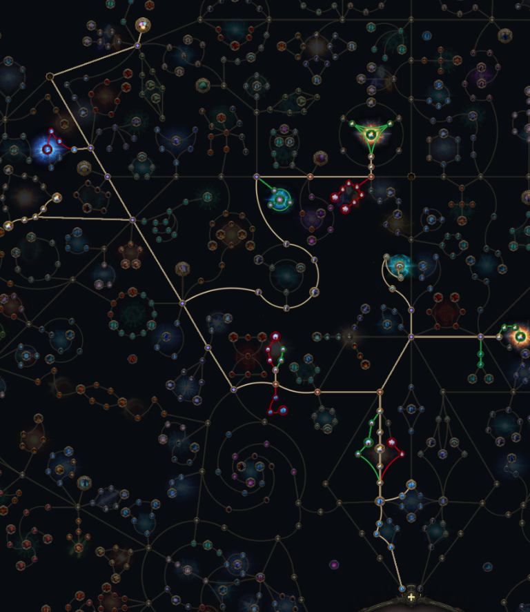

# Spark-Comet Campaign Build

The [league launch guide](../../index.html) includes this setup under Campaign > Spark-Comet, alongside Twisters. Campaign Zone Rewards are shared; Spark-Comet uses the vendor regexes below instead of spear progression.

Gem Cutting Priority lists which support to cut and where to socket it, in priority order within each uncut gem tier. Modifier cutoffs in the guide cover extra lightning damage, all Spell Skill levels, and Fire Spell Skill levels (also applicable to Cold and Lightning), using the supplied screenshots.

The regexes below contain Markdown escapes; the guide displays and copies the unescaped regex text for use in game.

The gems table follows the Twisters layout: Icon, Skill, and Supports, with attribute-colored support names and Roman-numeral cutting-level badges. Hover a support name for the support tiers from these notes. Galvanic Field has no cutting levels specified, so its support tiers are shown explicitly instead. Skill icons and support attribute colors are sourced from [PoE2DB](https://poe2db.tw/us/Skill_Gems); icons are stored locally so the guide does not depend on remote image loading.

Support colors use the requirements verified on [PoE2DB's support index](https://poe2db.tw/us/Support_Gems), not elemental tags. Zarokh's Refrain retains the guide's gold Lineage styling (its attribute requirement is +5 Int). The guide uses the canonical names Compressed Duration and Shock Conduction for the corresponding entries below.

## Gem Cutting Priority

Read each tier from left to right:

- **Tier 1:** Pierce I on Spark; Controlled Destruction on Spark; Overabundance I on Orb of Storms; Fortress I on Flame Wall; Spell Cascade on Flame Wall.
- **Tier 2:** Considered Casting on Spark; Controlled Destruction on Orb of Storms (move the existing gem from Spark; do not cut another); Short Fuse I on Frost Bomb; Potent Exposure on Frost Bomb; Harmonic Remnants II on Mana Remnants.
- **Tier 3:** Pierce II on Spark; Prolonged Duration II on Spark; Remnant Potency II on Mana Remnants; Spell Echo on Comet; Elemental Focus on Comet; Fortress II on Flame Wall.
- **Tier 4:** Short Fuse II on Frost Bomb; Remnant Potency III on Mana Remnants.
- **Tier 5:** Pierce III on Spark; Projectile Acceleration III on Spark; Cold Mastery on Siphon Elements.

## Quest Choices

| Quest | Choice |
|-------|--------|
| Valley of the Titans | +1 Charm, 30% Charge Generation (Left) |
| Venom Crypts Vial | Elemental Ailment Threshold |
| Abandoned Prison Chapel | Mana Flask Recovery |
| Halls of the Dead Totems | +5% to Fire, Cold, and Lightning Resistances |
| Qimah The Seven Pillars | +5% to all Elemental Resistances |

## Passive Tree

The supplied screenshot is shown beside Quest Choices in the guide. Click it to enlarge or restore it.

## Ascendancy: Stormweaver

Take the connecting small passive first, then its notable:

| Ascendancy | Small passive | Notable |
|------------|---------------|---------|
| 1st | Mana Regeneration | Constant Gale |
| 2nd | Remnant Range | Refracted Infusion |
| 3rd | Shock Chance | Strike Twice |
| 4th | Shock Chance (after Strike Twice) | Shaper of Storms |

The build declares `Sorceress1` (Stormweaver). This allocation order is retained as a reference; ascendancy nodes will be included in the appropriate leveling stages rather than as generic level 1-100 recommendations. Node IDs and connections are verified against [GGG's passive-tree export](https://github.com/grindinggear/poe2-skilltree-export).

## In-game Build Planner

Import [spark-comet.build](./spark-comet.build) using [GGG's Build Planner instructions](https://www.pathofexile.com/developer/docs/game#buildplanner).

After editing the build, run `.\sync-build.ps1` from the repository root. The [sync script](../../sync-build.ps1) validates the JSON and copies it to `%USERPROFILE%\OneDrive\Documents\My Games\Path of Exile 2\BuildPlanner`, verifying the copied file. It runs once and exits; there is no background watcher.

The 13 skill IDs and 44 unique support IDs were checked against PoE2DB's `ItemType` metadata. Both `Metadata/Items/Gem/` and `Metadata/Items/Gems/` are valid prefixes for different entries; do not normalize them.

All listed skill gems except the weapon-granted Galvanic Field are recommended for character levels 1-100. Fireball is also included so it can be cut for the trigger setups.

| Character levels | Support recommendations |
|------------------|-------------------------|
| 1-46 | Only the 21 entries in Gem Cutting Priority above, attached to their specified skills. Hover notes retain each entry's priority group and order. |
| 47-100 | The complete main-table support pools, including alternatives and successive tiers. Mana Remnants includes both Harmonic Remnants I and II, as confirmed. |

These are recommendation ranges, not overrides of gem requirements or simultaneous socket setups. A support present in both ranges has separate non-overlapping recommendation entries.

Passive recommendations are incremental: each range shows only nodes newly added or changed from the preceding screenshot, not the complete target tree. Unchanged earlier recommendations stop appearing, even if the player has not allocated them yet. At level 20, for example, only the 24 additions for levels 15-28 are recommended; none of the 19 nodes from levels 1-14 are repeated.

| Character levels | New or changed recommendations |
|------------------|--------------------------------|
| 1-14 | 19 |
| 15-28 | 24 |
| 29-44 | 24 |
| 45-54 | 18 |
| 55-61 | 12 |
| 62-65 | 16 |
| 66-74 | 10 |
| 75-84 | 10 |
| 85-92 | 7 |
| 93-95 | 17, including Raw Power's change from shared to weapon set 1 |
| 96-100 | None |

Respecs still require manual refunds. Hover notes on the new routes at levels 55-61 and 93-95 explain which old paths to refund. A changed weapon-set or attribute recommendation may show an earlier node again; unchanged recommendations do not.

The complete screenshot targets are retained below as reference totals, not counts of highlighted recommendations:

| Character levels | Screenshot target (reference only) |
|------------------|--------------|
| 1-14 | Level 14 screenshot: 13 shared nodes, 4 weapon-set-1 nodes toward Exploit the Elements, and 2 weapon-set-2 nodes toward Affliction Enforcer via the lower Elemental Ailment Chance node. The top travel attribute is +5 Dexterity; the two left travel attributes are +5 Intelligence. |
| 15-28 | 27 shared nodes, 8 weapon-set-1 nodes, and 8 weapon-set-2 nodes. Adds shared Potent Incantation and a travel jewel socket, Empowering Infusions and Infusion Consumption Chance on set 1, and Secrets of the Orb plus Stripped Defences via the lower Elemental Damage node on set 2. The travel attributes beside Potent Incantation and the exposure cluster are +5 Strength; the new northern travel attributes are +5 Intelligence. |
| 29-44 | 43 shared nodes, 12 weapon-set-1 nodes, and 12 weapon-set-2 nodes. Adds shared Practiced Signs via Cast Speed from Raw Power, Hastening Barrier, two Energy Shield nodes, Frozen Limit, and northern travel with +5 Intelligence choices. Set 1 adds a second Infusion Consumption Chance node and Preservation through both Increased Duration nodes. Set 2 adds Overexposure via the right Exposure Effect node and one Reduced Duration node. |
| 45-54 | 53 shared nodes, 16 weapon-set-1 nodes, and 16 weapon-set-2 nodes. Adds shared Heavy Buffer with the lower Energy Shield node, Convalescence through all three Energy Shield Delay nodes, and northeastern travel with a jewel socket and +5 Intelligence choices. Set 1 adds Everlasting Infusions and Turn the Clock Forward via the lower projectile branch. Set 2 completes Forthcoming and adds two Additional Remnant Chance nodes. |
| 55-61 | 56 shared nodes, 20 weapon-set-1 nodes, and 20 weapon-set-2 nodes. Extends west through Energy Shield and two +5 Intelligence travel nodes. Set 1 adds Chronomancy via two Duration nodes and one Remnant Pickup Range node. Set 2 adds Remnant Attraction and respecs the inner Elemental Damage node below Overexposure into the outer-right route, also taking the left Exposure Effect and Elemental Ailment Chance nodes. |
| 62-65 | 64 shared nodes and 24 per weapon set. Adds shared Shimmering Mirage through the lower threshold path (+5 Strength on its travel attribute), southeastern travel with two +5 Intelligence choices, and two Elemental Damage entry nodes. Set 1 adds Echoing Frost, Echoing Thunder, and Echoing Flames through their central Elemental Damage node. Set 2 adds Roil through three Spell Area of Effect nodes. |
| 66-74 | 74 shared nodes and 24 per weapon set. Adds shared Soul Bloom through three Energy Shield Delay nodes, Hallowed from the lower threshold node, and Pure Energy via Cast Speed from Practiced Signs, continuing to Dampening Shield through the lower-left threshold node. Weapon-set branches are unchanged. |
| 75-84 | 84 shared nodes and 24 per weapon set. Adds four +5 Intelligence travel nodes west along the upper route, Infusing Power via Infusion Duration and both Infusion Chance nodes, and shared Principal Infusion via the lower Infused Spell Damage node. Weapon-set branches are unchanged. |
| 85-92 | 91 shared nodes and 24 per weapon set. Adds shared Illuminated Crown and a far-left route through a jewel socket and +5 Strength travel node to Touch the Arcane, taking Mana Regeneration and both Arcane Surge Effect nodes. Weapon-set branches are unchanged. |
| 93-95 | Final screenshot: 94 shared nodes and 24 per weapon set. Replaces the early spell-damage chain with four +5 Intelligence travel nodes and makes Raw Power set-1-only, removing that set's Remnant Pickup Range node. Removes the lower elemental and Practiced Signs / Pure Energy paths; Affliction Enforcer (set 2), Principal Infusion (shared), and Dampening Shield (shared) are approached from above instead. Adds a +5 Intelligence travel node, Patient Barrier, Ether Flow, and Abasement. |
| 96-100 | No passive recommendations specified. |

Each range shows its additions and changes together, not an individual point-by-point order. Later-stage boundaries are 75-84, 85-92, and 93-95, switching at each new stage's start without overlap. There are no generic level 1-100 passive recommendations.

The weapon-slot (`Weapon1`) Build Planner tooltip shows all three modifier cutoff groups from the guide for levels 1-100: extra lightning damage, all Spell Skill levels, and Fire Spell Skill levels (also applicable to Cold and Lightning). Each row lists the modifier tier, minimum item level, and roll. To keep it compact, the tooltip contains only rows, with blank lines between groups and the highest tier first within each group.

GGG currently documents meta gems as unsupported. Cast on Elemental Ailment and Cast on Critical remain experimental entries with warnings; manually socket Flame Wall and Fireball into the chosen trigger. Their recommendation display still requires in-game verification.

Lineage recommendations have been confirmed to display in-game. Zarokh's Refrain remains listed for Comet as an acquisition target: obtain it through drops or trade rather than cutting it from an Uncut Support Gem.

## Build Notes

Galvanic Field -> Chain I, Chain II, Chain III, Bounty I, Bounty II, OverAbundance I, OverAbundance II, Momentum, mobility

Act 1: "ld res|\\d+% i.+mov|ell.\*ge$|^\\+.\*all sp.\*ls$|^\\+.\*re sp.\*ls$|^\\+.\*ld sp.\*ls$|^\\+.\*ng sp.\*ls$|^\\+.\*ile skills$|o sp|s: st"

Act 2:

"(re|ng) res|\\d+% i.+mov|ell.\*ge$|^\\+.\*all sp.\*ls$|^\\+.\*re sp.\*ls$|^\\+.\*ng sp.\*ls$|^\\+.\*ile skills$|o sp|st spe|s: st"

Act 3,4

"(ld|os) res|(\[32]0|\[21]5)% i.+mov|ell.\*ge$|^\\+.\*all sp.\*ls$|^\\+.\*re sp.\*ls$|^\\+.\*ng sp.\*ls$|^\\+.\*ile skills$|o sp|st spe|s: st"

Act 5,6:

"(ld|os) res|(\[32]0|25)% i.+mov|ell.\*ge$|^\\+.\*all sp.\*ls$|^\\+.\*re sp.\*ls$|^\\+.\*ng sp.\*ls$|^\\+.\*ile skills$|o sp|st spe|s: st"

Maps Vendor

"(re|ld|ng|os) res|(30|25)% i.+mov|ell.\*ge$|^\\+.\*all sp.\*ls$|^\\+.\*ile skills$|o sp|st spe|s: st"

contagion

Spark ->
Lvl 1 -> Pierce I, Controlled Destruction, Projectile Acceleration I/Prolonged Duration I /Unleash

Lvl 2 -> Considered Casting, Lightning Pen (optional)

lvl 3 -> Prolonged Duration II, Pierce II

lvl 4 -> Projectile Acceleration II

lvl 5 -> Pierce III, Projectile Acceleration III

Orb of Storms
lvl 1 OverAbundance I, Compress Duration I, Innervate, Controlled Destruction (move the existing gem from Spark; do not cut another)
lvl 2 Harmonic Remnants I
lvl 3 Harmonic Remnants II, Compress Duration II
lvl 5 Shock Conductions, Chain III

Frost Bomb ->
lvl 1 -> Magnified area I, Innvervate
lvl 2 -> Short Fuse I, Potent Exposure, Harmonic Remnants I, Overabundance I, Spell Echo
lvl 3 -> Harmonic Remnants II, Second Wind II
lvl 4 -> Short fuse II, cooldown Recovery II,
lvl 5 -> Second Wind III

Flame Wall ->
lvl1 -> fortress I, spell cascade
lvl3 -> fortress II

Mana Remnants requires gem 4 ->
lvl 2 -> Harmonic Remnants I, Remnant Potency I
lvl 3 -> Harmonic Remnants I, Remnant Potency II
lvl 4 -> Remnant Potency III

Mana Tempest requires gem 7

lvl 2 -> cooldown recovery II

lvl 5 -> Lightning mastery

Siphon Elements requires gem 8

lvl 3 -> Harmonic Remnants II

lvl 5 -> cold mastery

Comet requires lvl 11 gem
lvl 2 -> Considered Casting, Rising Tempest
lvl 3 -> spell echo, Elemental Focus, Ambrosia II (notes: once 100+ charges mana flask), Execute II

lvl 5 -> Zarokh's Refrain

Elemental Conflux requires gem 14
lvl 4 -> prolonged duration II, compressed duration II
lvl 5 -> cold mastery

cast on elemental ailment requires gem 14 (100 spirit and use before swapping to crit on notes)
Skill Gems -> Flamewall, fireball
lvl 2 -> boundless Energy I
lvl 3 -> Ignite II, energy retention
lvl 4 -> boundless Energy II

cast on critical requires gem 14 (+90 spirit, replace Cast on elemental ailment after crit swap on notes)

Skill Gems -> Flamewall, fireball
lvl 2 -> boundless Energy I
lvl 3 -> Ignite II, energy retention
lvl 4 -> boundless Energy II
