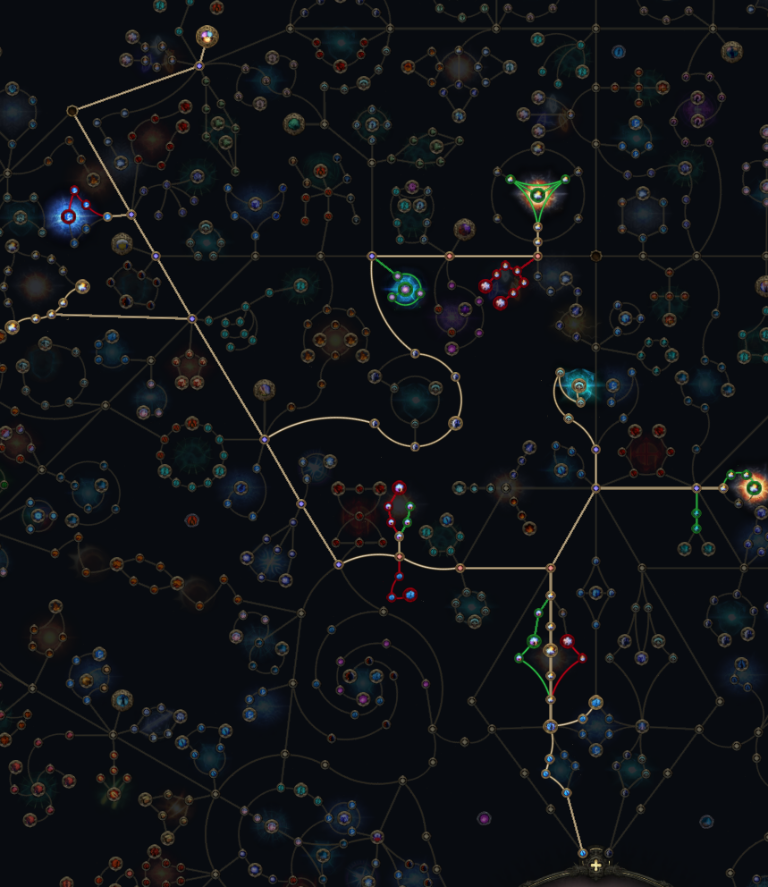

# Spark-Comet Campaign Build

The [league launch guide](../../index.html) includes this setup under Campaign > Spark-Comet, alongside Twisters. Campaign Zone Rewards are shared; Spark-Comet uses the vendor regexes below instead of spear progression.

Early Items > Spark-Comet groups recommendations into separate equipment-slot tables, with an additional Exclusive Mods and Augments table. Jewellery includes belts and charms. There is no standalone Boots table; boot modifiers remain in Exclusive Mods and Augments. The existing early-item lists remain under Twisters.

| Slot | Item | Modifier / Notes |
|------|------|------------------|
| Helmet | Devouring Diadem | Every 3 seconds, Consume a nearby Corpse to Recover 20% of maximum Life |
| Helmet | Atziri's Disdain | 10-20% rarity gain 10% life as extra ES |
| Helmet | Crown of Victor | Early +1 all skills helmet with rarity |
| Body Armour | Prayers for Rain | 30% slower start of ES Recharge ES Recharge is not interrupted by Damage if Recharge began Recently |
| Body Armour | Cloak of Defiance | (50—100)% increased Mana Regeneration Rate 50% of Damage is taken from Mana before Life |
| Body Armour | Waveshaper | 20-40 spirit + 60 res Increases and Reductions to Mana Regeneration Rate also apply to Energy Shield Recharge Rate |
| Body Armour | Temporalis | Endgame body armour |
| Gloves | Maligaro's Virtuosity (Fine Bracers) | Fixed 250% crit dmg bonus, perfect with Pinpoint |
| Gloves | Doedre's Tenure | 100% increased spell damage but 25% reduced cast speed |
| Gloves | Nightscale (Pauscale Gloves) | 150% increased mana regen if you've crit recently, but can't regen without a recent crit |
| Jewellery | Dream Fragments | |
| Jewellery | The Everlasting Gaze | 75% mana regen and mana gained as ES |
| Jewellery | Choir of the Storm | Critical Hits Ignore Enemy Monster Lightning Resistance |
| Jewellery | Beacon of Azis | +40-45 to spirit Critical Hits ignore Enemy Monster Elemental Resistances |
| Jewellery | Shavronne's Satchel (Belt) | ES from life flask |
| Jewellery | Nascent Hope (Charm) | |
| Jewellery | Beira's Anguish (Charm) | |
| Jewellery | Arakaali's Gift (Charm) | |
| Jewellery | Rite of Passage (Charm) | CAT for crit, speed \| OWL for es, dmg, gain cold |
| Jewels | Time-Lost Jewel | Double crit damage bonus + crit chance, if 5-mod jewel crafting remains available |
| Jewels | Sapphire Jewel | Double crit damage bonus + crit chance, if 5-mod jewel crafting remains available |
| Jewels | Prism of Belief | +3 to level of Spark |
| Jewels | From Nothing | Eldritch Battery |
| Flasks | Lavianga's Spirits (Gargantuan Mana Flask) | |
| Weapons | Adonia's Ego | Pinnacle of Power consumes all power charges for 15% more spell damage per charge consumed |
| Offhand | Deathrattle | 20% chance for Energy Shield Recharge to start when you Kill an Enemy |
| Offhand | Effigy of Cruelty | Critical Hits with Spells apply (1—3) Stacks of Critical Weakness |
| Exclusive Mods and Augments | Legacy of Lifesprig | +2 all spell |
| Exclusive Mods and Augments | Belt (Genesis Tree) | 80(50—55)% increased \[Spell\] |
| Exclusive Mods and Augments | Belt (Genesis Tree) | 80+(80—89) to maximum Energy Shield |
| Exclusive Mods and Augments | Ring (Genesis Tree) | +1 to level of all Spell Skills |
| Exclusive Mods and Augments | Ring (Genesis Tree) | Critical hit chance for spells |
| Exclusive Mods and Augments | Ring (Genesis Tree) | Critical damage bonus |
| Exclusive Mods and Augments | Ring (Genesis Tree) | Spell damage |
| Exclusive Mods and Augments | Ring (Genesis Tree) | Up to 39% increased Arcane Surge effect |
| Exclusive Mods and Augments | Amulet (Genesis Tree) | Cast on Critical skill |
| Exclusive Mods and Augments | Amulet (Genesis Tree) | Cast on Elemental Ailment skill |
| Exclusive Mods and Augments | Amulets and Rings (Essence of the Breach) | +20% to maximum quality |
| Exclusive Mods and Augments | Wands and Staves (Celestial Alloy) | +150 mana AND +1 to level of all Spell Skills |
| Exclusive Mods and Augments | Boots (Uhtred's Sidereus Augment) | 40% skill effect duration |
| Exclusive Mods and Augments | Boots (Uhtred's Sidereus Augment) | 15% chance to not remove Charges |
| Exclusive Mods and Augments | Boots (Cyclonic Alloy) | 18% skill effect duration |
| Exclusive Mods and Augments | Gloves (Kolr's Hunt) | +2 to all Projectile Skills |
| Exclusive Mods and Augments | Gloves (Kolr's Hunt) | 30% critical hit chance |
| Exclusive Mods and Augments | Gloves (Kolr's Hunt) | 40% projectile damage and projectile speed |
| Exclusive Mods and Augments | Gloves (Essence of Hysteria) | 25% crit damage bonus |
| Exclusive Mods and Augments | Gloves (Swift Alloy) | 10% cast speed |
| Exclusive Mods and Augments | Time-Lost Jewels (Ancient Potent Liquid Melancholy emotion) | Upgrades radius to Very Large |
| Exclusive Mods and Augments | Any Jewel (Ancient Potent Liquid Contempt emotion) | +1 suffix or prefix mod |
| Exclusive Mods and Augments | Normal Jewels (Potent Liquid Ferocity emotion) | 60% increased effect of prefixes or suffixes |
| Exclusive Mods and Augments | Normal Jewels (Liquid Despair emotion) | Critical spell chance |
| Exclusive Mods and Augments | Normal Jewels (Concentrated Liquid Fear emotion) | Critical spell damage |
| Exclusive Mods and Augments | Normal Jewels (Liquid Disgust emotion) | Recover % mana on kill |
| Exclusive Mods and Augments | Normal Jewels (Liquid Envy emotion) | Spell damage |
| Exclusive Mods and Augments | Normal Jewels (Diluted Liquid Ire emotion) | Energy Shield |
| Exclusive Mods and Augments | Hedgewitch Assandra's Rune of Wisdom (Augment) | +1 to level of all Spell Skills. |

Adonia's Ego is a [Siphoning Wand](https://poe2db.tw/us/Adonias_Ego), so it is grouped under Weapons, though it is reserved for the offhand setup. Deathrattle and Effigy of Cruelty are Focus items, grouped under Offhand.

### + to Spell and Projectile Skills Sources (Main-Hand Setup)

The Early Items summary table collects the spell and projectile skill-level sources recorded so far for the main-hand setup, including the campaign weapon cutoffs. Adonia's Ego is excluded from this summary because it is reserved for the offhand setup; its equipment recommendation remains unchanged. This is not an exhaustive list or a combined total; elemental-only bonuses are excluded.

| Source | Bonus / Notes |
|--------|---------------|
| Corrupted skill | +21 from corrupted skill |
| Weapon modifier | Up to +6 to level of all Spell Skills. |
| Weapon (Sanctify) | +1 to level of all Spell Skills. |
| Wands and Staves (Celestial Alloy) | +1 to level of all Spell Skills AND +150 mana. |
| Legacy of Lifesprig | +2 to level of all Spell Skills. |
| Hedgewitch Assandra's Rune of Wisdom (Augment) | +1 to level of all Spell Skills. |
| Amulet modifier | +4 to level of all Spell Skills. |
| Amulet (Sanctify) | +1 to level of all Spell Skills. |
| Crown of Victor (Helmet) | +1 all skills, including Spell Skills. Also has rarity. |
| Ring (Genesis Tree) | +1 to level of all Spell Skills. |
| Gloves (Kolr's Hunt) | +2 to all Projectile Skills. Projectile skills only, not all spells. |
| Prism of Belief (Jewel) | +3 to level of Spark. Spark only, not all spells. |

### Guide Layout

The build selector beside the page title controls Campaign, Early Items, and Crafting. Select Twisters or Spark-Comet once; switching tabs retains that selection, and changing builds keeps the current tab open. Twisters is the initial selection. Campaign Zone Rewards and Tablets remain shared.

Crafting has two stages: Endgame crafting and Mirror tier crafting. Budget and progression crafts are included under Endgame; premium foundations are under Mirror tier, without guaranteeing mirror-quality results. A left sidebar selects Weapon, Offhand, Helmet, Body Armour, Gloves, Boots, Belt, Rings, Amulet, or Jewels; it wraps above the content on small screens. Recipes are filtered by build, stage, and category. Each craft has a blank step heading, the base item type above the item column, and required rarity/modifiers above the notes column. Rows contain Step 1, Step 2, etc., the item to use, and notes with retry instructions. Stage and category selections remain selected when switching tabs or builds; the initial selection is Endgame crafting / Weapon.

Spark-Comet Early Items notes automatically highlight whole words, case-insensitively: ES / Energy Shield in a navy-blue shade lightened for the dark background, Mana in aquamarine, Spirit in green, and Critical / Crit in red. Item names and other sections retain their existing styling; these Markdown notes remain plain text.

Gem Priorities appears above the full gems-and-supports reference table. On wide screens, Tier 1-5 share the first row; Lesser Jeweller's Orb, GCP, Greater Jeweller's Orb, Perfect Jeweller's Orb, and Lineage Gems share the second row. Both rows wrap into fewer columns on smaller screens. Read each table from top to bottom. Modifier cutoffs in the guide cover extra lightning damage, all Spell Skill levels, and Fire Spell Skill levels (also applicable to Cold and Lightning), using the supplied screenshots.

The regexes below contain Markdown escapes; the guide displays and copies the unescaped regex text for use in game.

The gems table follows the Twisters layout: Icon, Skill, and Supports, with attribute-colored support names and Roman-numeral cutting-level badges. Hover a support name for the support tiers from these notes. Galvanic Field has no cutting levels specified, so its support tiers are shown explicitly instead. Skill icons and support attribute colors are sourced from [PoE2DB](https://poe2db.tw/us/Skill_Gems); icons are stored locally so the guide does not depend on remote image loading.

Support colors use the requirements verified on [PoE2DB's support index](https://poe2db.tw/us/Support_Gems), not elemental tags. Zarokh's Refrain retains the guide's gold Lineage styling (its attribute requirement is +5 Int). The guide uses the canonical names Compressed Duration and Shock Conduction for the corresponding entries below.

## Crafting

Routes use 0.5-era mechanics, not live price estimates. Set a spending cap for every retry loop. Removed recombinator methods and unverified rune-swap finishes are excluded.

- **Light + Annul** means activate Omen of Light, then use an Orb of Annulment to remove the desecrated modifier. This is not a safe repair for bad ordinary exalts.
- Activate directional omens before their currency. Sinistral/Dextral Necromancy selects the prefix/suffix side, not a guaranteed reveal.
- Abyssal Echoes offers one reveal-option reroll. Perfect Exalted Orbs do not guarantee T1. Ancient Jawbone raises minimum modifier level to 40, not guaranteed top tier.
- Lightning Spell Skills improve Spark, not Comet. Natural all-spell and lightning-level suffixes are not independent stackable level modifiers.
- Normally only one crafted modifier is allowed, separately from the one-desecrated-modifier limit. Dual-crafted routes need Astrid's Creativity; keep it installed.
- Finish sockets/augments only after deciding the item is worth keeping. Use each base's available socket limit. Corruption and sanctification are not routine safe steps.

Mechanics sources: [0.5.0 changes](https://www.pathofexile.com/forum/view-thread/3932540), [crafted modifiers](https://poe2db.tw/us/Crafted_Modifiers), [Omen of Light](https://poe2db.tw/us/Omen_of_Light), [staff modifiers](https://poe2db.tw/us/Staves#ModifiersCalc), [wand modifiers](https://poe2db.tw/us/Wands#ModifiersCalc).

### Endgame crafting - Weapon

<table>
  <thead>
    <tr><th></th><th>Magic Staff - Budget</th><th>+4 or +5 to all Spell Skills and a gain % damage prefix. No conflicting spell-damage prefix.</th></tr>
  </thead>
  <tbody>
    <tr><td>Step 1</td><td>Greater Essence of Sorcery</td><td>Upgrade to rare and add spell damage; use cheaper Sorcery if appropriate. A conflicting starting prefix means replacing the base.</td></tr>
    <tr><td>Step 2</td><td>Preserved Jawbone + Sinistral Necromancy (if cheap)</td><td>With a prefix slot open, activate the omen before the Jawbone and reveal another eligible gain % damage modifier. If it misses, keep/sell or replace a cheap base; on a valuable base, Light + Annul and repeat Step 2.</td></tr>
    <tr><td>Step 3</td><td>Exalted Orbs or Greater Exalted Orbs (if cheap) Artificer's Orbs Greater Iron Runes or Greater Glacial Runes</td><td>Fill remaining modifiers within budget, add available sockets and insert runes. Bad ordinary exalt: accept/sell or restart with a new base; Light cannot safely repair it.</td></tr>
  </tbody>
</table>

Sources: [Sorcery](https://poe2db.tw/us/Greater_Essence_of_Sorcery), [Sinistral Necromancy](https://poe2db.tw/us/Omen_of_Sinistral_Necromancy), [Iron](https://poe2db.tw/us/Greater_Iron_Rune), [Glacial](https://poe2db.tw/us/Greater_Glacial_Rune). Budget adaptation of the existing craft.

<table>
  <thead>
    <tr><th></th><th>Magic Wand - Budget</th><th>Affordable all Spell Skills or Lightning Spell Skills suffix and a useful gain % damage prefix. No conflicting spell-damage prefix.</th></tr>
  </thead>
  <tbody>
    <tr><td>Step 1</td><td>Essence of Sorcery</td><td>Use an affordable Lesser, normal or Greater essence to upgrade to rare and add spell damage.</td></tr>
    <tr><td>Step 2</td><td>Preserved Jawbone + Sinistral Necromancy (optional)</td><td>Activate Sinistral first if targeting an open prefix, apply the Jawbone and reveal a useful wand modifier. Gnawed Jawbone only works at item level 64 or below. Miss: keep/sell or restart; for a valuable item only, Light + Annul and repeat Step 2.</td></tr>
    <tr><td>Step 3</td><td>Exalted Orbs or Greater Exalted Orbs (if cheap) Artificer's Orbs Greater Iron Runes or Greater Glacial Runes</td><td>Fill remaining modifiers within budget and finish available sockets/runes. Do not use the staff socket limit or staff-only modifier pool. Bad ordinary exalt: accept/sell or restart.</td></tr>
  </tbody>
</table>

Sources: [Sorcery](https://poe2db.tw/us/Greater_Essence_of_Sorcery), [Gnawed Jawbone](https://poe2db.tw/us/Gnawed_Jawbone), [wand pool](https://poe2db.tw/us/Wands#ModifiersCalc).

<table>
  <thead>
    <tr><th></th><th>Rare Staff - Preserve Prefixes</th><th>Any 3 natural, noncrafted prefixes from the three gain % damage modifiers and % spell damage. No existing spell-level suffix or desecrated modifier. Prefer one disposable suffix and two open suffix slots.</th></tr>
  </thead>
  <tbody>
    <tr><td>Step 1</td><td>Dextral Crystallisation + Perfect Essence of Sorcery Exalted Orb (only if no suffix exists)</td><td>If no suffix exists, exalt once; full prefixes force a suffix. Activate Dextral Crystallisation and replace a suffix with +5 all Spell Skills before investing in a reveal. Reject conflicting crafted/level mods or a base leaving no space for Step 2.</td></tr>
    <tr><td>Step 2</td><td>Preserved Jawbone Abyssal Echoes (optional)</td><td>Desecrate an open suffix and reveal spell critical chance or cast speed. Full prefixes already force the suffix side. Activate Echoes before revealing for one reroll. Miss: Light + Annul and repeat Step 2 within budget.</td></tr>
    <tr><td>Step 3</td><td>Exalted Orbs or Greater Exalted Orbs (if cheap) Artificer's Orbs Greater Iron Runes or Greater Glacial Runes</td><td>Fill any final suffix and finish available sockets/runes. A bad ordinary suffix cannot be selectively removed with Light; accept/sell rather than blindly annulling.</td></tr>
  </tbody>
</table>

Sources: [PaintMaster (0.5 update)](https://mobalytics.gg/poe-2/profile/paintmaster/guides/recoup-chronomancer-gear-crafting-guide), [Perfect Sorcery](https://poe2db.tw/us/Perfect_Essence_of_Sorcery), [Dextral Crystallisation](https://poe2db.tw/us/Omen_of_Dextral_Crystallisation). Reordered from the original craft so Perfect Sorcery does not remove a freshly unveiled crit suffix.

<table>
  <thead>
    <tr><th></th><th>Magic Staff - Crit / Cast Speed</th><th>+5 or +6 Lightning Spell Skills and one useful damage prefix. Guide recommends item level 70+. Lightning levels help Spark, not Comet.</th></tr>
  </thead>
  <tbody>
    <tr><td>Step 1</td><td>Greater Essence of Seeking</td><td>Upgrade to rare with spell critical chance, retaining the starting level suffix and damage prefix.</td></tr>
    <tr><td>Step 2</td><td>Dextral Necromancy + Preserved Jawbone</td><td>Activate the omen, desecrate a suffix and leave it unrevealed. All suffix positions are occupied.</td></tr>
    <tr><td>Step 3</td><td>Omen of Greater Exaltation + Greater Exalted Orb</td><td>Add two random prefixes only with both prefix slots open. Bad prefixes: use/sell or restart Step 1 with a new magic base; Light cannot repair them.</td></tr>
    <tr><td>Step 4</td><td>Abyssal Echoes (optional) + reveal</td><td>Reveal cast speed, with one Echoes reroll if used. Miss with valuable prefixes: Light + Annul, return to Step 2, then skip Step 3 because prefixes are full. Otherwise stop.</td></tr>
    <tr><td>Step 5</td><td>Artificer's Orbs + Greater Iron Runes or Greater Glacial Runes</td><td>Modifiers are full. Finish available sockets/runes; no further exalt is needed.</td></tr>
  </tbody>
</table>

Sources: [PaintMaster low-budget weapon route](https://mobalytics.gg/poe-2/profile/paintmaster/guides/recoup-chronomancer-gear-crafting-guide), [Seeking](https://poe2db.tw/us/Greater_Essence_of_Seeking), [Greater Exaltation](https://poe2db.tw/us/Omen_of_Greater_Exaltation).

<table>
  <thead>
    <tr><th></th><th>Fractured Wand - High Budget</th><th>Rare item level 81+ wand with fractured +5 Lightning Spell Skills. Published example: Dueling Wand. Buy the fracture; no fracture success is guaranteed.</th></tr>
  </thead>
  <tbody>
    <tr><td>Step 1</td><td>Orbs of Annulment / Exalted Orb + Chaos Orbs</td><td>Clean up to exactly one mutable mod; exalt if none remain. Chaos that mod until spell critical chance, retaining the fracture. Miss: repeat the Chaos roll within budget.</td></tr>
    <tr><td>Step 2</td><td>Sinistral Exaltation + Exalted Orb Sinistral Crystallisation + Transcendent Alloy</td><td>Add a disposable prefix, then replace it with the alloy's cast-speed / extra-cold suffix using the respective omens. All suffixes are full: the completed-suffix checkpoint.</td></tr>
    <tr><td>Step 3</td><td>Preserved Jawbone + reveal Abyssal Echoes (optional)</td><td>Reveal plain maximum mana as a temporary prefix blocker. Miss: Light + Annul and repeat Step 3 within budget.</td></tr>
    <tr><td>Step 4</td><td>Omen of Greater Exaltation + Greater or Perfect Exalted Orb</td><td>Add two random prefixes. Bad ordinary prefixes: accept/sell or destructively rebuild from Step 1 around the fracture; Light cannot selectively fix them.</td></tr>
    <tr><td>Step 5</td><td>Omen of Light + Orb of Annulment Preserved Jawbone + reveal</td><td>Remove the mana blocker and reveal a useful wand damage prefix. Miss: repeat Step 5 within budget.</td></tr>
    <tr><td>Step 6</td><td>Artificer's Orbs + Hedgewitch Assandra's Rune of Wisdom</td><td>Add an available socket and insert the +1 all-spells rune. Result: +6 effective lightning spell levels, not +6 all spells. No further exalt is needed.</td></tr>
  </tbody>
</table>

Sources: [BigDaddy Gaming wand guide (0.5)](https://mobalytics.gg/poe-2/profile/bigdaddygaming/guides/0-5-7-wand-crafting-guide), [0.5.3 wand alloy restoration](https://www.pathofexile.com/forum/view-thread/3968601), [Hedgewitch rune](https://poe2db.tw/us/Hedgewitch_Assandras_Rune_of_Wisdom).

### Mirror tier crafting - Weapon

These are premium foundations with random outcomes, not promises of mirror-tier value.

<table>
  <thead>
    <tr><th></th><th>Magic Staff - Premium Foundation</th><th>Item level 81+, +7 Lightning Spell Skills and one disposable prefix. Lightning levels do not improve Comet.</th></tr>
  </thead>
  <tbody>
    <tr><td>Step 1</td><td>Greater Essence of Seeking</td><td>Upgrade to rare with spell critical chance, retaining +7 lightning and the disposable prefix.</td></tr>
    <tr><td>Step 2</td><td>Artificer's Orb + Astrid's Creativity</td><td>Add a socket if needed and insert Astrid to permit a second crafted mod. Keep it installed.</td></tr>
    <tr><td>Step 3</td><td>Sinistral Crystallisation + Transcendent Alloy</td><td>Activate the omen and replace the disposable prefix with the alloy's cast-speed / extra-cold suffix. Suffixes are full and prefixes empty.</td></tr>
    <tr><td>Step 4</td><td>Preserved Jawbone + reveal Abyssal Echoes (optional)</td><td>Reveal plain maximum mana as a temporary prefix blocker. Miss: Light + Annul and repeat Step 4 within budget.</td></tr>
    <tr><td>Step 5</td><td>Omen of Greater Exaltation + Perfect Exalted Orb</td><td>Add two random prefixes, not guaranteed T1 or ideal mods. Bad prefixes: accept/sell or restart Step 1 with a new magic base.</td></tr>
    <tr><td>Step 6</td><td>Omen of Light + Orb of Annulment Preserved or Ancient Jawbone + reveal</td><td>Remove the mana blocker and reveal a useful final staff prefix. Miss: repeat Step 6 within budget. Ancient Jawbone does not guarantee top-tier mods.</td></tr>
    <tr><td>Step 7</td><td>Artificer's Orbs + caster runes for remaining sockets</td><td>Modifiers are full. Finish available sockets without replacing Astrid. No routine corruption or sanctification gamble.</td></tr>
  </tbody>
</table>

Sources: [PaintMaster high-budget weapon route](https://mobalytics.gg/poe-2/profile/paintmaster/guides/recoup-chronomancer-gear-crafting-guide), [Astrid](https://poe2db.tw/us/Astrids_Creativity), [Transcendent Alloy](https://poe2db.tw/us/Transcendent_Alloy).

<table>
  <thead>
    <tr><th></th><th>Fractured Wand - Dual-Alloy Foundation</th><th>Item level 81+ rare wand with fractured +5 Lightning Spell Skills, natural spell critical chance, and a Transcendent Alloy suffix. All prefixes empty: the High Budget Wand's completed-suffix checkpoint.</th></tr>
  </thead>
  <tbody>
    <tr><td>Step 1</td><td>Completed-suffix base Artificer's Orb + Astrid's Creativity</td><td>Buy this exact base or complete Steps 1-2 of the Endgame Fractured Wand route, stopping before its blocker. Install Astrid for two crafted mods; do not start with leftover prefixes.</td></tr>
    <tr><td>Step 2</td><td>Preserved Jawbone Sinistral Crystallisation + Celestial Alloy</td><td>Add an unrevealed sacrificial prefix, activate the omen, and replace it with the alloy's mana / +1 all-spells prefix.</td></tr>
    <tr><td>Step 3</td><td>Preserved Jawbone + reveal Abyssal Echoes (optional)</td><td>Reveal hybrid spell damage / mana as the temporary blocker. Miss: Light + Annul and repeat Step 3 within budget. Keep the Celestial Alloy prefix.</td></tr>
    <tr><td>Step 4</td><td>Perfect Exalted Orb</td><td>Add one ordinary prefix; only one slot is open. Miss: keep/sell or rebuild; Light cannot remove this specific ordinary mod.</td></tr>
    <tr><td>Step 5</td><td>Omen of Light + Orb of Annulment Preserved or Ancient Jawbone + reveal</td><td>Remove the hybrid blocker and reveal the final useful wand prefix. Miss: repeat Step 5 within budget.</td></tr>
    <tr><td>Step 6</td><td>Remaining legal socket / augment options</td><td>Keep Astrid installed. +5 lightning and +1 all spells means +6 effective lightning levels. The unverified Astrid-to-Hedgewitch swap is excluded; no promised +7 finish or mirror quality.</td></tr>
  </tbody>
</table>

Sources: [BigDaddy Gaming expensive wand branch](https://mobalytics.gg/poe-2/profile/bigdaddygaming/guides/0-5-7-wand-crafting-guide), [Celestial Alloy](https://poe2db.tw/us/Celestial_Alloy), [Astrid](https://poe2db.tw/us/Astrids_Creativity). The supported two-craft setup is retained without the unverified rune swap.

## Gem Cutting Priority

Read each tier's table from top to bottom. These priorities are the source for the Build Planner recommendations; reference-only alternatives are not included unless listed here.

Bracketed numbers identify support slots within each skill. New supports take the next slot unless specified; upgrades reuse their slot. Unleash starts in Spark [2]; move it to Comet [1] until Spark is 5-link, then use Spark [4]. Considered Casting takes Spark [2]. Projectile Acceleration II uses Spark [3] at Tier 4; Projectile Acceleration III retains that slot at Tier 5. Zarokh's Refrain replaces Spell Echo in Comet [2] (both belong to the [Spell Echo category](https://poe2db.tw/us/Zarokhs_Refrain)). Build-file support notes include these slots, priority order, and relevant transfer or replacement instructions.

- **Tier 1:** Pierce I on Spark [1]; Unleash on Spark [2] [4]; Overabundance I on Orb of Storms [1]; Fortress I on Flame Wall [1]; Spell Cascade on Flame Wall [2]; Shock on Orb of Storms [2]; Innervate on Orb of Storms [3]; Clarity I on Arctic Armour [1]; Unleash on Comet [1] (move from Spark until Spark is 5-link); Spell Cascade on Frost Bomb [5]; Deep Freeze on Arctic Armour [5]; Spell Cascade on Cast on Elemental Ailment [4]; Spell Cascade on Cast on Critical [4].
- **Tier 2:** Considered Casting on Spark [2]; Short Fuse I on Frost Bomb [1]; Spell Echo on Frost Bomb [2]; Freeze on Arctic Armour [2]; Harmonic Remnants I on Mana Remnants [1]; Remnant Potency I on Mana Remnants [2]; Rising Tempest on Spark [5]; Potent Exposure on Frost Bomb [3]; Harmonic Remnants I on Siphon Elements [1]; Second Wind I on Mana Tempest [1]; Considered Casting on Comet [5]; Boundless Energy I on Cast on Elemental Ailment [5]; Boundless Energy I on Cast on Critical [5]; Pinpoint Critical on Spark [5].
- **Tier 3:** Pierce II on Spark [1]; Remnant Potency II on Mana Remnants [2]; Spell Echo on Comet [2]; Fortress II on Flame Wall [1]; Harmonic Remnants II on Mana Remnants [1]; Harmonic Remnants II on Siphon Elements [1]; Cooldown Recovery I on Mana Tempest [2]; Prolonged Duration II on Flame Wall [3]; Knockback on Arctic Armour [3]; Ambrosia II on Comet [4]; Mobility on Mana Tempest [4]; Electromagnetism on Orb of Storms [5]; Energy Retention on Cast on Elemental Ailment [3]; Energy Retention on Cast on Critical [3]; Inexorable Critical I on Comet [3].
- **Tier 4:** Short Fuse II on Frost Bomb [1]; Remnant Potency III on Mana Remnants [2]; Projectile Acceleration II on Spark [3]; Second Wind II on Mana Tempest [1]; Cooldown Recovery II on Mana Tempest [2]; Execute II on Comet [3]; Cooldown Recovery II on Frost Bomb [4]; Cooldown Recovery II on Arctic Armour [4]; Boundless Energy II on Cast on Elemental Ailment [5]; Boundless Energy II on Cast on Critical [5].
- **Tier 5:** Pierce III on Spark [1]; Projectile Acceleration III on Spark [3]; Cold Mastery on Siphon Elements [2]; Second Wind III on Mana Tempest [1]; Lightning Mastery on Mana Tempest [3]; Chain III on Orb of Storms [4]; Cold Mastery on Elemental Conflux [1]; Flame Wall on Cast on Elemental Ailment [1]; Flame Wall on Cast on Critical [1]; Comet on Cast on Elemental Ailment [2]; Comet on Cast on Critical [2].
- **Lineage:** Zarokh's Refrain on Comet [2]; Vilenta's Propulsion on Spark [3], replacing Projectile Acceleration; Ixchel's Torment on Cast on Elemental Ailment [4], replacing Spell Cascade; Arbiter's Ignition on Cast on Critical [4], replacing Spell Cascade; Uhtred's Exodus on Elemental Conflux [1], replacing Cold Mastery; Uhtred's Rite on Frost Bomb [5], replacing Spell Cascade; Dominus' Grasp on Orb of Storms [4], replacing Chain III; Khatal's Rejuvenation on Mana Remnants [3]; Uhtred's Omen on Siphon Elements [2], replacing Cold Mastery; Breachlord's Rift on Arctic Armour [5], replacing Deep Freeze (obtain Lineage gems through drops or trade, not by cutting an Uncut Support Gem).

Flame Wall and Comet are triggered skill gems, grouped under Tier 5 for planning rather than cut from Uncut Support Gems.

## Gem Upgrade Priority

- **Lesser Jeweller's Orb:** Spark; Orb of Storms; Frost Bomb; Comet; Flame Wall; Arctic Armour; Mana Tempest; Mana Remnants.
- **GCP:** Spark; Orb of Storms; Elemental Conflux; Arctic Armour; Frost Bomb; Mana Remnants; Comet; Mana Tempest; Siphon Elements; Cast on Elemental Ailment; Cast on Critical.
- **Greater Jeweller's Orb:** Spark; Frost Bomb; Comet; Orb of Storms; Arctic Armour; Cast on Elemental Ailment; Cast on Critical; Mana Tempest.
- **Perfect Jeweller's Orb:** Spark; Frost Bomb; Comet; Cast on Elemental Ailment; Cast on Critical; Orb of Storms; Arctic Armour.

## Quest Choices

| Quest | Choice |
|-------|--------|
| Valley of the Titans | +1 Charm, 30% Charge Generation (Left) |
| Venom Crypts Vial | Elemental Ailment Threshold |
| Abandoned Prison Chapel | Mana Flask Recovery |
| Halls of the Dead Totems | +5% to Fire, Cold, and Lightning Resistances |
| Qimah The Seven Pillars | +5% to all Elemental Resistances |

## Passive Tree

The supplied screenshot is shown beside Quest Choices in the guide. Click it to enlarge or restore it.

## Ascendancy: Stormweaver

Take the connecting small passive first, then its notable:

| Ascendancy | Small passive | Notable |
|------------|---------------|---------|
| 1st | Mana Regeneration | Constant Gale |
| 2nd | Remnant Range | Refracted Infusion |
| 3rd | Shock Chance | Strike Twice |
| 4th | Shock Chance (after Strike Twice) | Shaper of Storms |

The build declares `Sorceress1` (Stormweaver). This allocation order is retained as a reference; ascendancy nodes will be included in the appropriate leveling stages rather than as generic level 1-100 recommendations. Node IDs and connections are verified against [GGG's passive-tree export](https://github.com/grindinggear/poe2-skilltree-export).

## In-game Build Planner

Import [spark-comet.build](./spark-comet.build) using [GGG's Build Planner instructions](https://www.pathofexile.com/developer/docs/game#buildplanner).

After editing the build, run `.\sync-build.ps1` from the repository root. The [sync script](../../sync-build.ps1) validates the JSON and copies it to `%USERPROFILE%\OneDrive\Documents\My Games\Path of Exile 2\BuildPlanner`, verifying the copied file. It runs once and exits; there is no background watcher.

Skill and support IDs were checked against PoE2DB's `ItemType` metadata. Both `Metadata/Items/Gem/` and `Metadata/Items/Gems/` are valid prefixes for different entries; do not normalize them.

The build contains 13 skill recommendations: Contagion appears only at character levels 1-2 (no supports specified), while the other 12 skills, including Arctic Armour, span levels 1-100. Weapon-granted Galvanic Field remains excluded. Flame Wall and Comet are the trigger payloads; the obsolete Fireball recommendation has been removed.

| Character levels | Support recommendations |
|------------------|-------------------------|
| 1-70 | All 59 non-Lineage support associations from the priority tables, including successive tiers and same-slot alternatives. No Lineage recommendations. |
| 71-100 | The same 59 support associations plus all 10 Lineage recommendations (69 total). |

These are recommendation ranges, not overrides of gem requirements or simultaneous socket setups. A support present in both ranges has separate non-overlapping recommendation entries. Each support's hover note includes its slot number(s), priority group/order, and relevant short guidance. Spell Echo on Comet retains its Tier 3 planning position while noting that it can be cut from Tier 2.

Same-slot entries are upgrades or alternatives, not simultaneous supports: this includes Rising Tempest / Pinpoint Critical on Spark [5], Inexorable Critical I / Execute II on Comet [3], and the Lineage replacements. Ambrosia II retains the 100+ mana-flask-charge condition. The four Flame Wall / Comet trigger placements from Tier 5 are documented in skill notes rather than misrepresented as support gems.

Passive recommendations are incremental: each range shows only nodes newly added or changed from the preceding screenshot, not the complete target tree. Unchanged earlier recommendations stop appearing, even if the player has not allocated them yet. At level 20, for example, only the 24 additions for levels 15-28 are recommended; none of the 19 nodes from levels 1-14 are repeated.

| Character levels | New or changed recommendations |
|------------------|--------------------------------|
| 1-14 | 19 |
| 15-28 | 24 |
| 29-44 | 24 |
| 45-54 | 18 |
| 55-61 | 12 |
| 62-65 | 16 |
| 66-74 | 10 |
| 75-84 | 10 |
| 85-92 | 7 |
| 93-95 | 17, including Raw Power's change from shared to weapon set 1 |
| 96-100 | None |

Respecs still require manual refunds. Hover notes on the new routes at levels 55-61 and 93-95 explain which old paths to refund. A changed weapon-set or attribute recommendation may show an earlier node again; unchanged recommendations do not.

The complete screenshot targets are retained below as reference totals, not counts of highlighted recommendations:

| Character levels | Screenshot target (reference only) |
|------------------|--------------|
| 1-14 | Level 14 screenshot: 13 shared nodes, 4 weapon-set-1 nodes toward Exploit the Elements, and 2 weapon-set-2 nodes toward Affliction Enforcer via the lower Elemental Ailment Chance node. The top travel attribute is +5 Dexterity; the two left travel attributes are +5 Intelligence. |
| 15-28 | 27 shared nodes, 8 weapon-set-1 nodes, and 8 weapon-set-2 nodes. Adds shared Potent Incantation and a travel jewel socket, Empowering Infusions and Infusion Consumption Chance on set 1, and Secrets of the Orb plus Stripped Defences via the lower Elemental Damage node on set 2. The travel attributes beside Potent Incantation and the exposure cluster are +5 Strength; the new northern travel attributes are +5 Intelligence. |
| 29-44 | 43 shared nodes, 12 weapon-set-1 nodes, and 12 weapon-set-2 nodes. Adds shared Practiced Signs via Cast Speed from Raw Power, Hastening Barrier, two Energy Shield nodes, Frozen Limit, and northern travel with +5 Intelligence choices. Set 1 adds a second Infusion Consumption Chance node and Preservation through both Increased Duration nodes. Set 2 adds Overexposure via the right Exposure Effect node and one Reduced Duration node. |
| 45-54 | 53 shared nodes, 16 weapon-set-1 nodes, and 16 weapon-set-2 nodes. Adds shared Heavy Buffer with the lower Energy Shield node, Convalescence through all three Energy Shield Delay nodes, and northeastern travel with a jewel socket and +5 Intelligence choices. Set 1 adds Everlasting Infusions and Turn the Clock Forward via the lower projectile branch. Set 2 completes Forthcoming and adds two Additional Remnant Chance nodes. |
| 55-61 | 56 shared nodes, 20 weapon-set-1 nodes, and 20 weapon-set-2 nodes. Extends west through Energy Shield and two +5 Intelligence travel nodes. Set 1 adds Chronomancy via two Duration nodes and one Remnant Pickup Range node. Set 2 adds Remnant Attraction and respecs the inner Elemental Damage node below Overexposure into the outer-right route, also taking the left Exposure Effect and Elemental Ailment Chance nodes. |
| 62-65 | 64 shared nodes and 24 per weapon set. Adds shared Shimmering Mirage through the lower threshold path (+5 Strength on its travel attribute), southeastern travel with two +5 Intelligence choices, and two Elemental Damage entry nodes. Set 1 adds Echoing Frost, Echoing Thunder, and Echoing Flames through their central Elemental Damage node. Set 2 adds Roil through three Spell Area of Effect nodes. |
| 66-74 | 74 shared nodes and 24 per weapon set. Adds shared Soul Bloom through three Energy Shield Delay nodes, Hallowed from the lower threshold node, and Pure Energy via Cast Speed from Practiced Signs, continuing to Dampening Shield through the lower-left threshold node. Weapon-set branches are unchanged. |
| 75-84 | 84 shared nodes and 24 per weapon set. Adds four +5 Intelligence travel nodes west along the upper route, Infusing Power via Infusion Duration and both Infusion Chance nodes, and shared Principal Infusion via the lower Infused Spell Damage node. Weapon-set branches are unchanged. |
| 85-92 | 91 shared nodes and 24 per weapon set. Adds shared Illuminated Crown and a far-left route through a jewel socket and +5 Strength travel node to Touch the Arcane, taking Mana Regeneration and both Arcane Surge Effect nodes. Weapon-set branches are unchanged. |
| 93-95 | Final screenshot: 94 shared nodes and 24 per weapon set. Replaces the early spell-damage chain with four +5 Intelligence travel nodes and makes Raw Power set-1-only, removing that set's Remnant Pickup Range node. Removes the lower elemental and Practiced Signs / Pure Energy paths; Affliction Enforcer (set 2), Principal Infusion (shared), and Dampening Shield (shared) are approached from above instead. Adds a +5 Intelligence travel node, Patient Barrier, Ether Flow, and Abasement. |
| 96-100 | No passive recommendations specified. |

Each range shows its additions and changes together, not an individual point-by-point order. Later-stage boundaries are 75-84, 85-92, and 93-95, switching at each new stage's start without overlap. There are no generic level 1-100 passive recommendations.

The weapon-slot (`Weapon1`) Build Planner tooltip shows all three modifier cutoff groups from the guide for levels 1-100: extra lightning damage, all Spell Skill levels, and Fire Spell Skill levels (also applicable to Cold and Lightning). Each row lists the modifier tier, minimum item level, and roll. To keep it compact, the tooltip contains only rows, with blank lines between groups and the highest tier first within each group.

GGG currently documents meta gems as unsupported. Cast on Elemental Ailment and Cast on Critical remain experimental entries with warnings; manually socket Flame Wall [1] and Comet [2] into the chosen trigger. The setup is also recorded on the payload skills as a fallback. Their recommendation display still requires in-game verification.

Lineage recommendations have been confirmed to display in-game. All 10 Lineage associations are acquisition targets for levels 71-100 only: obtain them through drops or trade rather than cutting them from Uncut Support Gems.

## Build Notes

Galvanic Field -> Chain I, Chain II, Chain III, Bounty I, Bounty II, OverAbundance I, OverAbundance II, Momentum, mobility

Act 1: "ld res|\\d+% i.+mov|ell.\*ge$|\\d l.+da|^\\+.\*all sp.\*ls$|^\\+.\*ld sp.\*ls$|^\\+.\*ng sp.\*ls$|^\\+.\*ile skills$|o sp|s: (am|ri)"

Act 2:

"y: r|(re|ng) res|\\d+% i.+mov|ell.\*ge$|\\d l.+da|^\\+.\*all sp.\*ls$|^\\+.\*ld sp.\*ls$|^\\+.\*ng sp.\*ls$|^\\+.\*ile skills$|o sp|s: (am|ri)"

Acts 3-6:

"y: r|(re|ld|ng) res|(\[32]0|\[21]5)% i.+mov|ell.\*ge$|\\d l.+da|^\\+.\*all sp.\*ls$|^\\+.\*ld sp.\*ls$|^\\+.\*ng sp.\*ls$|^\\+.\*ile skills$|o sp|s: (am|ri)"

Maps Vendor

"y: r|(re|ld|ng) res|(30|25)% i.+mov|ell.\*ge$|\\d l.+da|^\\+.\*all sp.\*ls$|^\\+.\*ld sp.\*ls$|^\\+.\*ng sp.\*ls$|^\\+.\*ile skills$|o sp|d rari|s: (am|ri|be|st)"

contagion

Spark ->
Lvl 1 -> Pierce I, Controlled Destruction, Projectile Acceleration I / Unleash

Lvl 2 -> Considered Casting, Lightning Pen (optional)

lvl 3 -> Pierce II

lvl 4 -> Projectile Acceleration II

lvl 5 -> Pierce III, Projectile Acceleration III

Orb of Storms
lvl 1 OverAbundance I, Compress Duration I, Innervate, Controlled Destruction (move the existing gem from Spark; do not cut another)
lvl 2 Harmonic Remnants I
lvl 3 Harmonic Remnants II, Compress Duration II
lvl 5 Shock Conductions, Chain III

Frost Bomb ->
lvl 1 -> Magnified area I, Innvervate
lvl 2 -> Short Fuse I, Potent Exposure, Harmonic Remnants I, Overabundance I, Spell Echo
lvl 3 -> Harmonic Remnants II, Second Wind II
lvl 4 -> Short fuse II, cooldown Recovery II,
lvl 5 -> Second Wind III

Flame Wall ->
lvl1 -> fortress I, spell cascade
lvl3 -> fortress II

Mana Remnants requires gem 4 ->
lvl 2 -> Harmonic Remnants I, Remnant Potency I
lvl 3 -> Harmonic Remnants I, Remnant Potency II
lvl 4 -> Remnant Potency III

Arctic Armour requires gem 4 ->
lvl 1 -> Clarity I
lvl 2 -> Freeze

Mana Tempest requires gem 7

lvl 2 -> cooldown recovery II

lvl 5 -> Lightning mastery

Siphon Elements requires gem 8

lvl 3 -> Harmonic Remnants II

lvl 5 -> cold mastery

Comet requires lvl 11 gem
lvl 2 -> Considered Casting, Rising Tempest
lvl 3 -> spell echo, Elemental Focus, Ambrosia II (notes: once 100+ charges mana flask), Execute II

lvl 5 -> Zarokh's Refrain

Elemental Conflux requires gem 14
lvl 4 -> prolonged duration II, compressed duration II
lvl 5 -> cold mastery

cast on elemental ailment requires gem 14 (100 spirit and use before swapping to crit on notes)
Skill Gems -> Flamewall, fireball
lvl 2 -> boundless Energy I
lvl 3 -> Ignite II, energy retention
lvl 4 -> boundless Energy II

cast on critical requires gem 14 (+90 spirit, replace Cast on elemental ailment after crit swap on notes)

Skill Gems -> Flamewall, fireball
lvl 2 -> boundless Energy I
lvl 3 -> Ignite II, energy retention
lvl 4 -> boundless Energy II
