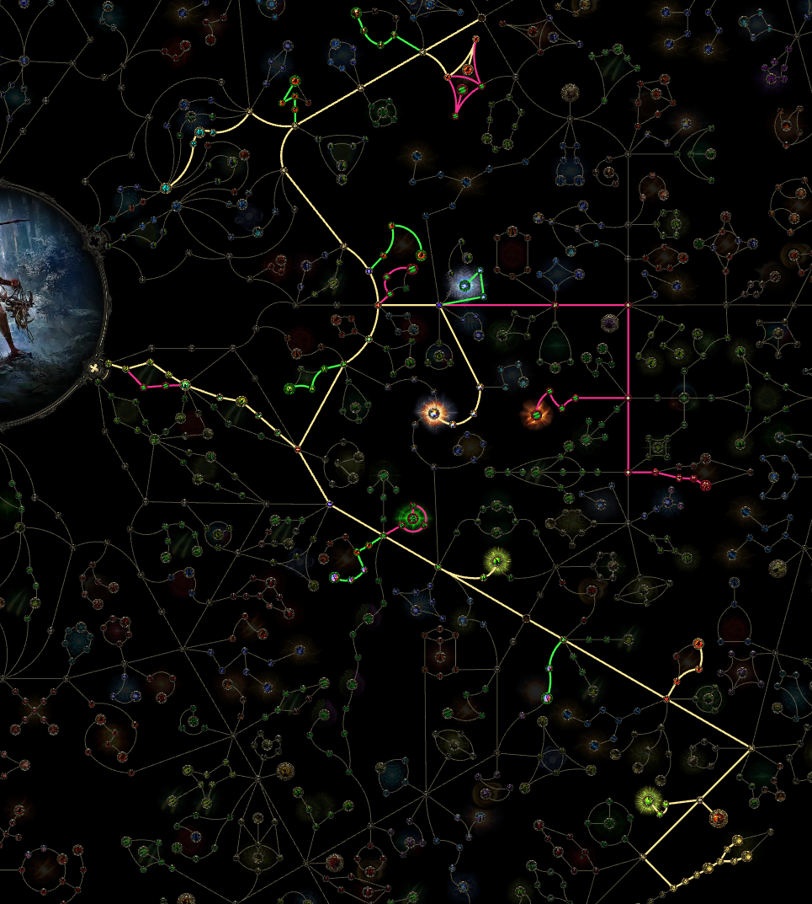

# Twisters Build - League Launch Guide

**League Start Regex:** `"!(uiv)" "spear|mov|[egdl] da.* to a"`  
**Spear Progression:** Hardwood `1` > Ironhead `5` > Hunting `10` > Winged `16` > War `21` > Forked `26` > Barbed `33` > Broad `40` > Crossblade `45` > Seaglass `51` > Sword `52` > Striking `55` > Helix `65` > Steelhead `45` > Coursing `48` > Swift `51` > Branched `54` > Jagged `59` > Massive `62` > Orichalcum `67` > Soaring `70` > Pronged `72` > Stalking `77` > Flying `78` > Grand `79` > Spiked `77` > Guardian `75` > Akoyan `78`

**Sceptre:** BUY THIS AT LEVEL 16. It's used for Malice and extra spirit.

**Legend:** `I, II, III...` = Gem cutting levels | `D` = Drop after | `S` = Swap | `[text]` = Notes  
**Colors:** 🔴 Strength (+90) · 🟢 Dexterity (+110) · 🔵 Intelligence (+115) · 🟡 Lineage

---

## Campaign Zone Rewards

**Act 1**

| Zone | Reward |
|------|--------|
| Cemetery of the Eternals | Regal Orb |
| Hunting Grounds | Exalted Orb |
| Ogham Village | Artificer's Orb |
| Ogham Manor | Orb of Alchemy |

**Act 2**

| Zone | Reward |
|------|--------|
| Vastiri Outskirts | Exalted Orb |
| The Halani Gates | Exalted Orb |
| The Lost City | Orb of Alchemy |
| Buried Shrines | Lesser Jeweller's Orb |
| Mastodon Badlands | Regal Orb |
| The Bone Pits | Exalted Orb |

**Act 3**

| Zone | Reward |
|------|--------|
| Jungle Ruins | Orb of Alchemy |
| Infested Barrens | Exalted Orb |
| Jiquani's Sanctum | Exalted Orb |

**Act 4**

| Zone | Reward |
|------|--------|
| Kedge Bay | Exalted Orb |
| Journey's End | Orb of Alchemy |
| Abandoned Prison | Exalted Orb |
| Eye of Hinekora | Chaos Orb |
| Ngakanu | Greater Jeweller's Orb |

**Interlude 1**

| Zone | Reward |
|------|--------|
| Stones of Serle | Exalted Orb |

**Interlude 2**

| Zone | Reward |
|------|--------|
| Pools of Khatal | Orb of Alchemy |
| Qimah | Exalted Orb |

**Interlude 3**

| Zone | Reward |
|------|--------|
| Howling Caves | Chaos Orb |
| Etched Ravine | Exalted Orb |

---

| Icon | Skill | Supports |
|------|-------|----------|
|  | **Whirling Slash** | 🔴Rage `I, IV, V` - 🟢Rapid Attacks `I, IV, V` - 🔴Knockback `III` - 🔵Magnified Area `I, III` - 🟢Punch Through `III` - 🟢Heightened Accuracy `III` - 🟡Rigwalds Ferocity |
|  | **Twister** | 🟢Retreat `I, III, V` - 🟢Projectile Acceleration `I, IV, V` *[if extra]* - 🔵Frost Nexus `II, S` - 🔴Elemental Armament `I, II` - 🔵Conc Area `I` - 🔵Ice Bite `I, III` - 🟢Longshot `II, III` - 🟢Close Combat `III, V` - 🔵Pinpoint Critical `II` - 🟡Rakiata - 🟡Garukhan's Resolve |
|  | **Frost Bomb `I`** *[DROP after Act 1]* | 🔵Magnified Area `I, D` |
|  | **War Banner `IV`** | 🔴Prolonged Duration `I, III` - 🔵Magnified Area `I, III` - 🔴Efficiency `I, IV` *[optional]* - 🔴Life Tap `II` *[optional]* |
|  | **Barrage `V`** | 🔵Rapid Casting `I, IV` - 🟢Cooldown Recovery `III, IV` - 🔴Prolonged Duration `I, III, D` - 🔴Life Tap `II` - 🟢Second Wind `II, IV, V` - 🟢Heightened Charges `II` |
|  | **Ice-Tipped Arrows `V`** | 🔴Elemental Armament `I, II` - 🔵Magnified Area `I, D` - 🟢Cooldown Recovery `III, IV, D` - 🔵Elemental Focus `III` - 🟢Second Wind `II, IV, V` - 🟢Culling Strike `IV, V` - 🔵Cold Exposure `IV` |
|  | **Freezing Mark `VII`** | 🔴Prolonged Duration `I, III` - 🟢Charged Mark `V` - 🔵Mark of Siphoning `I, IV` - 🔴Mark for Death `II, IV` - 🔴Efficiency `I, IV` - 🔴Life Tap `II` |
|  | **Herald of Ice `VIII`** | 🔴Elemental Armament `I, II` - 🔵Cold-Attunement `I, D` - 🔵Frost Nexus `II` - 🔵Magnified Area `I, III, D` - 🔵Freeze `II` - 🔵Embitter `II` - 🔵Cold Mastery `V, D` - 🟡Diala's Desire |
|  | **Herald of Thunder `IV`** | 🔴Elemental Armament `I, II` - 🔵Conc Area `I` - 🟢Long Shot - 🟢Maim `II` - 🔵Living Lightning `II, IV` - 🔵Elemental Focus `III` - 🟡Oisin's Oath |
|  | **Thunderous Leap `VII`** | 🟢Rapid Attacks `I, IV, V` |
|  | **Combat Frenzy `VIII`** | 🟢Charged Profusion `I` - 🔵Empowered Sparks `II, IV` - 🔴Cannibalism `III, IV` *[if spirit on item]* - 🔴Herbalism `II, IV` |
|  | **Wind Dancer** | 🔵Magnified Area `I, III` - 🟢Blind `II, V` - 🔴Knockback `III` - 🟢Pin `I, II` - 🟢Heightened Accuracy `III` - 🟢Maim `II` |

---

---

## Quest Choices

| Quest | Choice |
|-------|--------|
| Valley of the Titans | +1 Charm, 30% Charge Generation (Left) |
| Venom Crypts Vial | 25% increased Stun Threshold |
| Abandoned Prison Chapel | 30% increased recovery from Life Flasks |
| Halls of the Dead Totems | +5 to Strength, Dexterity, and Intelligence |
| Qimah The Seven Pillars | 15% increased Global Defences **OR** +5% to all Elemental Resistances **OR** 12% increased Cooldown Recovery Rate |

