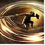
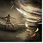
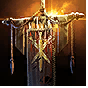
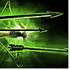
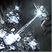
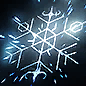
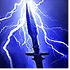
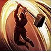
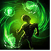
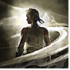

# Twisters Build - League Launch Guide

**Legend:** `I, II, III...` = Gem cutting levels | `D` = Drop after | `S` = Swap | `[text]` = Notes  
**Colors:** 🔴 Strength (+90) · 🟢 Dexterity (+110) · 🔵 Intelligence (+115) · 🟡 Lineage

---

| Icon | Skill | Supports |
|------|-------|----------|
|  | **Whirling Slash** | 🔴Rage `(I, IV, V)` - 🟢Rapid Attacks `(I, IV, V)` - 🔴Knockback `(III)` - 🔵Magnified Area `(I, III)` - 🟢Punch Through `(III)` - 🟢Heightened Accuracy `(III)` - 🟡Rigwalds Ferocity |
|  | **Twister** | 🟢Retreat `(I, III, V)` - 🟢Projectile Acceleration `(I, IV, V)` *[if extra]* - 🔵Frost Nexus `(II, S)` - 🔴Elemental Armament `(I, II)` - 🔵Conc Area `(I)` - 🔵Ice Bite `(I, III)` - 🟢Longshot `(II, III)` - 🟢Close Combat `(III, V)` - 🔵Pinpoint Critical `(II)` - 🟡Rakiata - 🟡Garukhan's Resolve |
|  | **Frost Bomb** *[DROP after Act 1]* | 🔵Magnified Area `(I, D)` |
|  | **War Banner `(IV)`** | 🔴Prolonged Duration `(I, III)` - 🔵Magnified Area `(I, III)` - 🔴Efficiency `(I, IV)` *[optional]* - 🔴Life Tap `(II)` *[optional]* |
|  | **Barrage `(V)`** | 🔵Rapid Casting `(I, IV)` - 🟢Cooldown Recovery `(III, IV)` - 🔴Prolonged Duration `(I, III, D)` - 🔴Life Tap `(II)` - 🟢Second Wind `(II, IV, V)` - 🟢Heightened Charges `(II)` |
|  | **Ice-Tipped Arrows `(V)`** | 🔴Elemental Armament `(I, II)` - 🔵Magnified Area `(I, D)` - 🔵Elemental Focus `(III)` - 🟢Cooldown Recovery `(III, IV, D)` - 🟢Second Wind `(II, IV, V)` - 🟢Culling Strike `(IV, V)` - 🔵Cold Exposure `(IV)` |
|  | **Freezing Mark `(VII)`** | 🔴Prolonged Duration `(I, III)` - 🟢Charged Mark `(V)` - 🔵Mark of Siphoning `(I, IV)` - 🔴Mark for Death `(II, IV)` - 🔴Efficiency `(I, IV)` - 🔴Life Tap `(II)` |
|  | **Herald of Ice `(VIII)`** | 🔴Elemental Armament `(I, II)` - 🔵Cold-Attunement `(I, D)` - 🔵Frost Nexus `(II)` - 🔵Magnified Area `(I, III, D)` - 🔵Freeze `(II)` - 🔵Embitter `(II)` - 🔵Cold Mastery `(V, D)` - 🟡Diala's Desire |
|  | **Herald of Thunder** | 🔴Elemental Armament `(I, II)` - 🔵Conc Area `(I)` - 🟢Long Shot - 🟢Maim `(II)` - 🔵Living Lightning `(II, IV)` - 🔵Elemental Focus `(III)` - 🟡Oisin's Oath |
|  | **Thunderous Leap `(VII)`** | 🟢Rapid Attacks `(I, IV, V)` |
|  | **Combat Frenzy** | 🟢Charged Profusion `(I)` - 🔵Empowered Sparks `(II, IV)` - 🔴Cannibalism `(III, IV)` *[if spirit on item]* - 🔴Herbalism `(II, IV)` |
|  | **Wind Dancer** | 🔵Magnified Area `(I, III)` - 🟢Blind `(II, V)` - 🔴Knockback `(III)` - 🟢Pin `(I, II)` - 🟢Heightened Accuracy `(III)` - 🟢Maim `(II)` |
